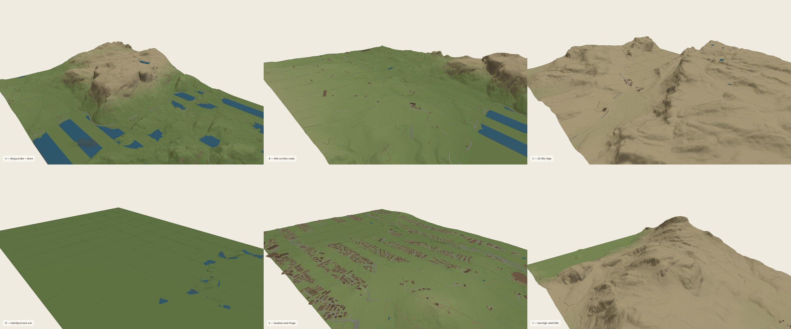
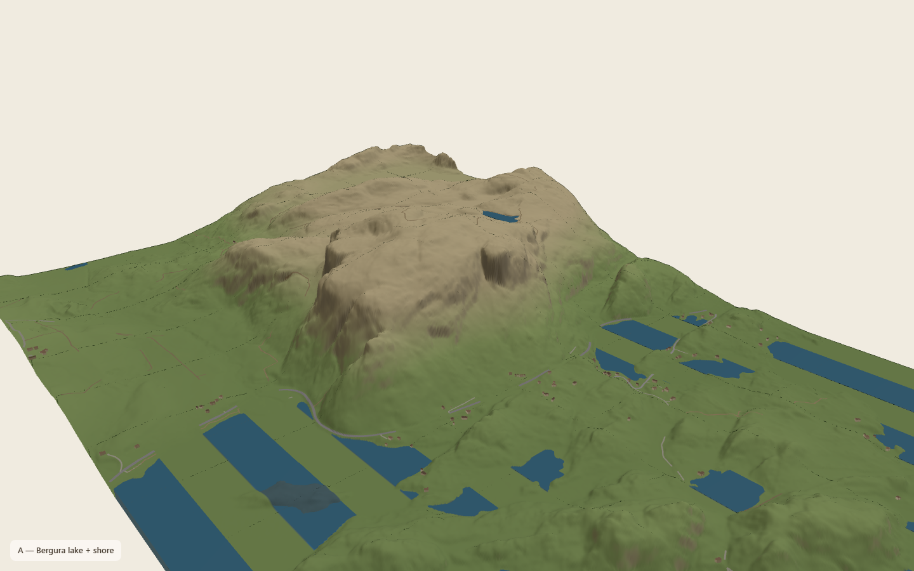
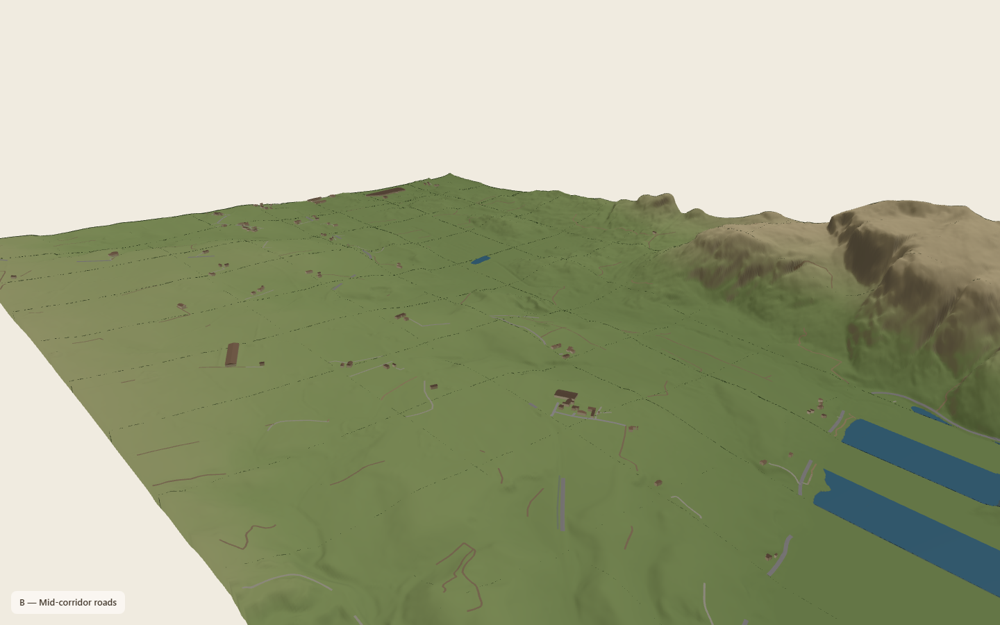
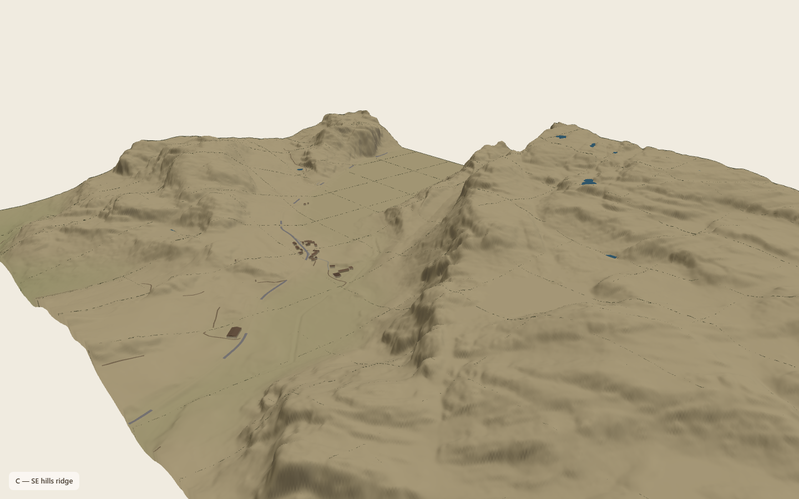
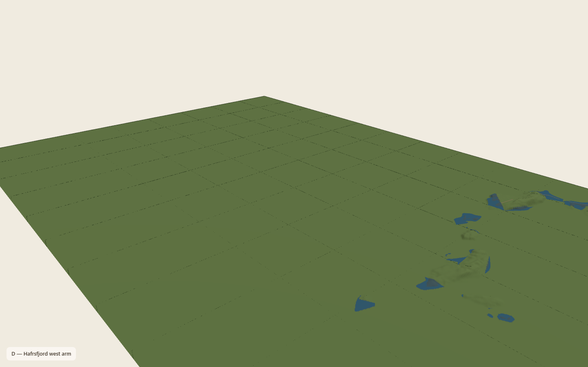
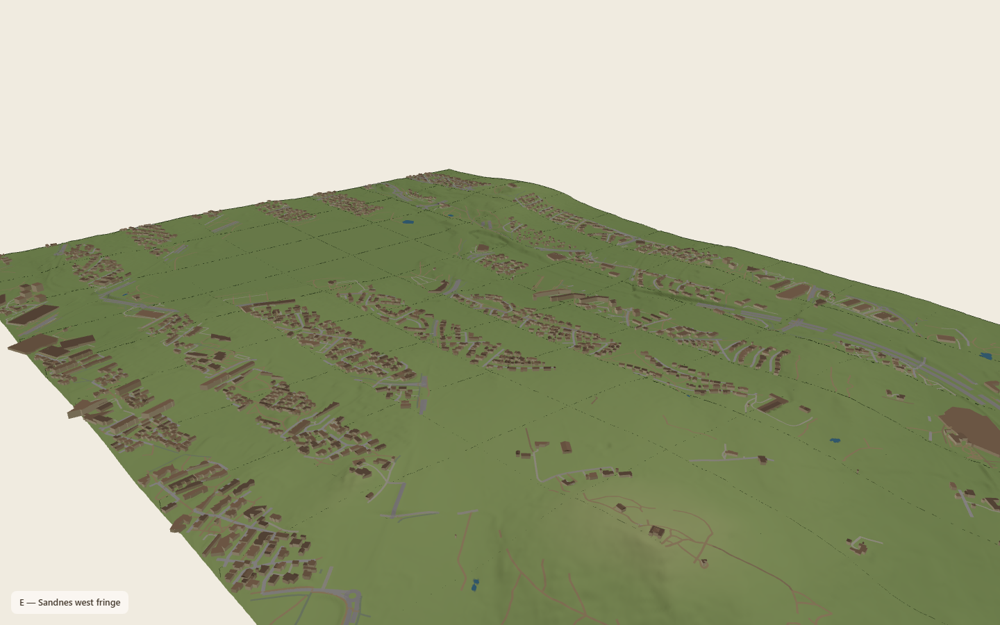
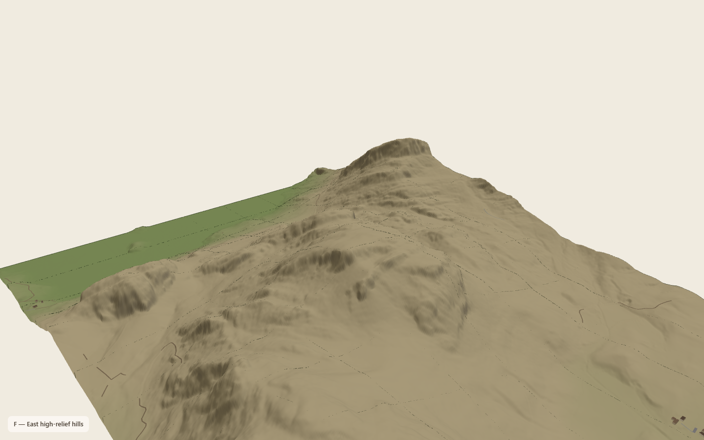

# WEB.1 Hero region candidates — choice gate

**Status:** **chosen: A** — Bergura lake + shore  
**Fog:** accepted (FOG.VISUAL.TRUTH).  
**Next:** Lab same-camera comparison pair → GLB/meshopt atomic package (A5.4).

## Intent

Curated **~2 × 3 km** real Rogaland plates (not the full Bergura–Sandnes corridor). Composition over raw size. After pick: three LOD rings, cinematic camera, atomic load-before-show, mobile tighter crop, same-camera Lab comparison.

## Shared contact camera

| Param | Value |
| --- | --- |
| FOV | 42° |
| Yaw | −0.72 rad |
| Distance | 2000 m |
| Height above focus | 900 m |
| Look-at lift | 20 m |
| Drift | off for captures |

Registry: [`hero/public/hero-candidates.json`](../hero/public/hero-candidates.json)

## LOD plan (winner only)

- **Core 1 × 1 km:** full buildings/roofs, roads, water, production trees  
- **Middle:** terrain + water + main roads; reduced vegetation  
- **Outer:** simplified terrain horizon; sparse/no buildings  
- Headline/CTA over the candidate’s **quietHeadlineQuadrant**

## Score table (published tiles)

See [candidate-scores.md](./hero-contact-sheets/candidate-scores.md) (generated).

| ID | Name | Elev span | Bld | Roads | Water | Forests | Complete |
| --- | --- | ---: | ---: | ---: | ---: | ---: | --- |
| A | Bergura lake + shore | 316 m | 200 | 292 | 155 | 37 | yes |
| B | Mid-corridor roads | 305 m | 305 | 522 | 37 | 69 | yes |
| C | SE hills ridge | 291 m | 29 | 97 | 30 | 24 | yes |
| D | Hafrsfjord west arm | 25 m | 0 | 9 | 62 | 0 | yes |
| E | Sandnes west fringe | 111 m | 4840 | 4555 | 16 | 163 | yes |
| F | East high-relief hills | 436 m | 29 | 110 | 2 | 16 | yes |

## Contact sheet

Open locally:

- Mosaic: [`hero-contact-sheets/contact-sheet.png`](./hero-contact-sheets/contact-sheet.png)
- HTML grid: [`hero-contact-sheets/contact-sheet.html`](./hero-contact-sheets/contact-sheet.html)
- Frames: `candidate-A.png` … `candidate-F.png`
- Scores: [`candidate-scores.md`](./hero-contact-sheets/candidate-scores.md)



| | | |
| --- | --- | --- |
|  |  |  |
| **A** lake + shore | **B** corridor roads | **C** SE ridge |
|  |  |  |
| **D** Hafrsfjord (flat) | **E** Sandnes fringe | **F** east high-relief |

Capture notes: full terrain plate; semantic sampled with `semStride=2` for capture time. Same camera for all frames.

```bash
cd c:\dev\origintrailz-site
npm run capture:hero-candidates
```

Uses built `hero/dist-candidates` + `/world` → `C:\OrigintrailzWorld\published`.

## How to choose

Reply with one letter **A–F**. Prefer the frame that best balances: recognisable ridge or steep relief, lake/fjord cut, winding road, roof cluster, real forest, and elev variation without flat unfinished tiles.

## After pick (next pass)

1. Stage winner pack + apply LOD rings  
2. Retune camera + mobile crop  
3. Same-camera World Lab vs site PNG pair  
4. GLB/meshopt + atomic reveal under accepted fog  
